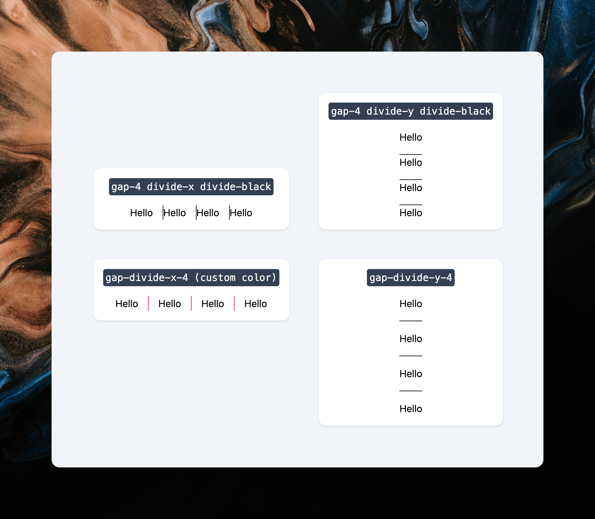

<p align="center">
	
  <br />
  <br />
</p>

# tailwind-gap-divide

A Tailwind plugin that allows you to divide the gap between elements.

## Installation

```bash
npm install tailwind-gap-divide
```

## Usage

```js
import plugin from "tailwind-gap-divide";

export default {
	content: ["./index.html", "./src/**/*.{js,ts,jsx,tsx}"],
	theme: {
		extend: {},
	},
	plugins: [plugin],
};
```

## License

MIT
